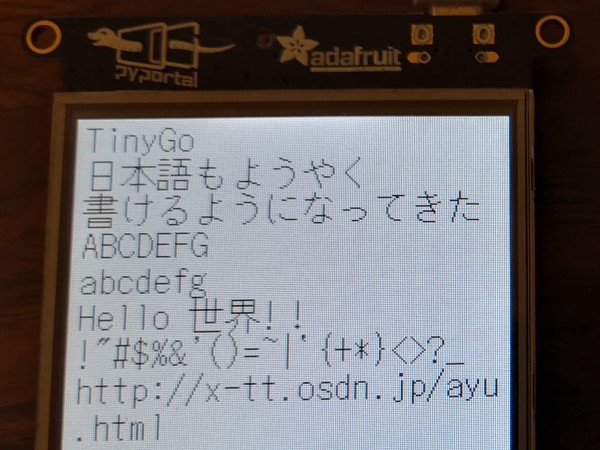

# TinyUFont

TinyUFont is a font/text package for TinyGo displays.  

## VS. github.com/tinygo-org/tinyfont

* TinyGo font files can be created from BDF fonts (tinyufontgen)
* Unicode font support
  * Tested with jisx0208 (Japanese) font only
* Usage is the same as tinygo-org/tinyfont

## Description

Generate a font file using `tinyufontgen` described later.  
Codepoints <= 255 are always included in the font.  
For fonts with a code point of 256 or more, only those specified by the argument are included in the font.  

## Usage

    // https://mplus-fonts.osdn.jp/mplus-bitmap-fonts/download/index.html
    tinyufontgen --ascii-font mplus_j10b-iso.bdf --font mplus_j10r.bdf --output font.go 日本語

    // http://x-tt.osdn.jp/ayu.html
    tinyufontgen --ascii-font 10x20grkm.bdf --font k20gm.bdf --output font.go 日本語

## Installation

    go get github.com/sago35/tinyufont/cmd/tinyufontgen

### Environment

* go
* kingpin.v2

## Notice

None.

## License

Copyright (c) 2020 sago35  
Released under the MIT license  
https://opensource.org/licenses/mit-license.php  

## Author

sago35 - <sago35@gmail.com>
